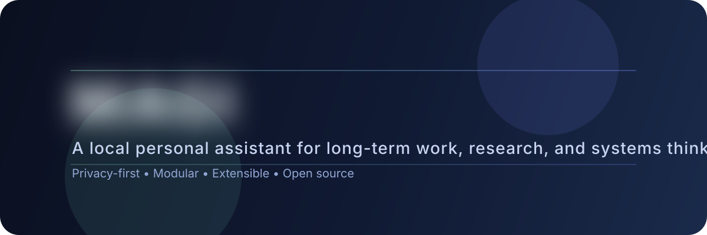

<div align="center">
  
</div>

<h1 align="center">MAGI</h1>

<p align="center">
  A local personal assistant designed to grow over years, not a general-purpose chatbot.
  <br/>
  <em>Privacy-first, modular, extensible, and fully under user control.</em>
</p>

<p align="center">
  
  
  
  
</p>

<p align="center">
  <a href="#-overview">Overview</a> •
  <a href="#-progress">Progress</a> •
  <a href="#-features">Features</a> •
  <a href="#-roadmap">Roadmap</a> •
  <a href="#-project-structure">Project structure</a> •
  <a href="#-license">License</a>
</p>

---

## Overview

MAGI is a long-term personal assistant inspired by the MAGI system from Neon Genesis Evangelion. The goal is not to build another ChatGPT clone, a search engine, or an artificial general intelligence project from scratch.

The goal is to build a practical companion for programming, cybersecurity, Linux, networking, electronics, research, and project management. MAGI is intended to stay local, private, and extensible.

This repository is still at an early concept stage. The architecture is being shaped carefully so the project can evolve without locking into poor technical decisions too early.

---

## Progress

<div align="center">
  
</div>

MAGI is currently focused on vision, structure, naming, and the foundations for a public-facing repository. Core implementation is still to come.

---

## Features

- **Local-first design** - execution and data handling are meant to stay on the user's machines.
- **Modular architecture** - interface, orchestrator, memory, tools, and models are separated by responsibility.
- **Multi-machine workflow** - the project is designed to live across a desktop, a laptop, and a secondary machine.
- **Specialized personas** - one base model with multiple roles instead of three completely separate models.
- **Long-term memory** - layered persistence for profile, sessions, vectors, and cache.
- **Tool-oriented workflow** - shell, git, GitHub, files, web, and documentation integration are part of the intended core.

---

## What MAGI is not

- a social platform;
- a generic chatbot;
- a ChatGPT clone;
- a search engine;
- a general intelligence system;
- a model trained from scratch.

---

## Target architecture

```text
User
  ↓
Interface
  ↓
Orchestrator
  ↓
Memory
  ↓
Tools
  ↓
Models
```

### Interface

The interface should allow users to:

- chat with MAGI;
- view logs;
- inspect system state;
- manage projects;
- access tools.

### Orchestrator

The orchestrator is the core of the system. It should:

- route requests;
- manage models;
- select tools;
- handle memory;
- coordinate tasks;
- monitor the system.

### Memory

The memory layer is intended to be split into multiple stores:

```text
memory/
├── profile.db
├── sessions.db
├── vectors.db
└── cache.db
```

### Tools

```text
tools/
├── shell/
├── git/
├── github/
├── files/
├── web/
└── docs/
```

MAGI should eventually be able to:

- inspect repositories;
- modify files;
- execute commands;
- consult documentation;
- search for information;
- summarize documents.

---

## Personas

MAGI does not need three completely separate models at the beginning. The current direction is to use one main model with specialized personas.

```text
                 MAGI
                    │
       ┌────────────┼────────────┐
       ▼            ▼            ▼
   MELCHIOR     BALTHASAR     CASPER
```

### MELCHIOR

Focus:

- programming;
- architecture;
- debugging;
- algorithms.

### BALTHASAR

Focus:

- planning;
- documentation;
- communication;
- organization.

### CASPER

Focus:

- research;
- reflection;
- analysis;
- decision support.

---

## Language and stack

The final stack is still open, but the current direction is pragmatic:

- use Python first for orchestration, tools, and product logic;
- use Rust later for components that truly need performance, isolation, or strong reliability.

In practice, a hybrid approach is the safest path. Starting in Python keeps the project moving. Moving selected parts to Rust later can improve robustness without freezing the project too early.

---

## Model direction

The main model is not fixed yet. A strong candidate could be Qwen3, but the final choice will depend on:

- reasoning quality;
- instruction following;
- local inference cost;
- orchestration compatibility;
- long-term maintainability.

---

## How MAGI should work

```text
Question
  ↓
MAGI
  ↓
Memory
  ↓
Tools
  ↓
Model
  ↓
Answer
```

The idea is that MAGI should not reply from a prompt alone. It should first consult memory, then use the relevant tools, and only then rely on the model for the final response.

---

## Development machines

### Desktop PC

- Ryzen 5 7600X
- RX 7700 XT
- 32 GB RAM

Main use:

- inference;
- development;
- storage.

### MacBook Pro M3

Main use:

- development;
- experimentation;
- mobile work.

### ThinkPad T440p

Main use:

- terminal access;
- testing;
- remote access.

---

## Roadmap

- [x] Define the project vision and scope.
- [x] Align the repository presentation for public GitHub.
- [ ] Define the first stable technical stack.
- [ ] Build the orchestration layer.
- [ ] Implement the first memory layer.
- [ ] Add the first tool integrations.
- [ ] Design the first usable interface.
- [ ] Document the MVP architecture.

---

## Project structure

```text
MAGI/
├── assets/
│   ├── banner.svg
│   └── progress-range/
├── LICENSE
├── README.md
└── .gitignore
```

This repository is intentionally minimal for now. The codebase will grow around the architecture once the first implementation phase starts.

---

## Documentation

The documentation strategy will likely grow in layers:

- this README for the public-facing overview;
- architecture notes for design decisions;
- usage notes once the first implementation exists;
- roadmap and status pages as the project expands.

---

## License

MAGI is licensed under the MIT License. See [LICENSE](LICENSE) for details.

---

## Note

This README describes the current direction and the intended shape of the project, not a fixed final architecture. Technical choices are expected to evolve.
